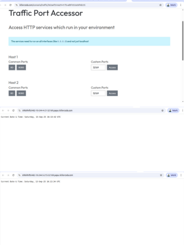

# Accuknox Product Management Trainee Assignment

# 📌 Product Requirements & Wireframes

> **Objective:**
> Design a product that helps users scan container images for vulnerabilities, identify critical issues, and prioritize remediation — even when managing thousands of images.

---

### 📄 Deliverables

✅ **Product Requirements + Low-Fidelity Wireframes** are documented in a single PDF:
📎 [`product_requirements.pdf`](product_requirements.pdf)

---

# 🔒 Kubernetes Security Scan

> **Objective**: Install a local Kubernetes cluster and scan it for security vulnerabilities using a tool like **Kubescape**. Output the findings in JSON format.

---

### 🛠️ Setup Steps

1. **Installed Minikube**:

   ```bash
   sudo usermod -aG docker ritik && newgrp docker
   minikube start
   ```

2. ✅ Verified that the cluster is running:

   ```bash
   minikube kubectl -- get po -A
   minikube kubectl get nodes
   ```

3. **Installed Kubescape** using the official instructions:

   ```bash
   curl -s https://raw.githubusercontent.com/kubescape/kubescape/master/install.sh | /bin/bash
   ```

4. **Scanned the local Kubernetes cluster and saved findings** in JSON:

   ```bash
   kubescape scan --format json -o findings.json
   ```

---

### 📄 Deliverable

✅ Security findings saved in: [`findings.json`](findings.json)

> This file contains a detailed list of Kubernetes misconfigurations, compliance violations, and security concerns as identified by Kubescape.

---


# 🕒 GoLang DateTime Web App — Kubernetes Deployment

> **Assignment Submission for Accuknox Product Management Trainee Role**

This project is a lightweight web application built in GoLang that displays the **current date and time**. It is containerized using Docker, deployed with **Kubernetes (K8s)** in a declarative manner, and exposed to the **public internet (WAN)** using a Kubernetes **NodePort service**.

---

## 📌 Problem Statement

**Step 1**:
✅ Build a **GoLang application** that displays the current date and time via HTTP.
✅ Containerize it using Docker and push the image to **DockerHub**.

**Step 2**:
✅ Use a **declarative approach** to deploy the Docker container to a **Kubernetes cluster** with **2 replicas**.

**Step 3**:
✅ Expose the application to the **Internet (WAN)** using a Kubernetes **Service**.

---

## 🧠 Tech Stack

| Tool / Technology | Purpose                       |
| ----------------- | ----------------------------- |
| GoLang            | Backend application           |
| Docker            | Containerization              |
| DockerHub         | Image registry                |
| Kubernetes (YAML) | Orchestration & deployment    |
| NodePort Service  | WAN exposure                  |
| Killercoda        | Kubernetes Playground (Cloud) |

---

## 💻 Application Code

### [`main.go`](main.go)

## 🐳 ['Dockerfile'](Dockerfile)

---

## 🚀 Build & Push to DockerHub

```bash
docker build -t ritik912/golang-datetime-app .
docker login
docker push ritik912/golang-datetime-app
```

📦 DockerHub Image: [`ritik912/golang-datetime-app`](https://hub.docker.com/r/ritik912/golang-datetime-app)

---

## ☸️ Kubernetes Deployment

### [`deployment.yaml`](deployment.yaml)

### [`service.yaml`](service.yaml)

---

## ⚙️ Kubernetes Commands

```bash
kubectl apply -f deployment.yaml
kubectl apply -f service.yaml
kubectl get svc datetime-app-service
kubectl get nodes -o wide
```

---

## 🌐 Accessing App on WAN (Public Internet)

To access the app from the internet:

1. I used **[Killercoda.com](https://killercoda.com/)** to create a Kubernetes environment with 2 nodes.

2. Cloned the GitHub repo and applied the Kubernetes manifests.

3. Found the `NodePort` (e.g., `32169`) using:

   ```bash
   kubectl get svc datetime-app-service
   ```

4. Clicked on "View Traffic / Sources" in Killercoda and opened the app via public URL:

   ```
   http://{public-ip}:{node-port}
   ```

✔️ Successfully verified in browser — showing real-time **Date & Time**.

---

## 📸 Preview



---

## 📁 Project Structure

```
.
├── main.go
├── Dockerfile
├── deployment.yaml
└── service.yaml
```

---

## 🧪 Testing

```bash
curl http://192.168.49.2:30189
# curl http://{internal-ip}:{node-port}
```

Output:

```
Current Date & Time: Saturday, 13-Sep-25 15:55:14 UTC
```

---

## 🤝 Acknowledgements

* [Accuknox](https://accuknox.com/) — for the exciting opportunity!
* [Killercoda](https://killercoda.com/) — for providing a free Kubernetes playground.

---

## 🧑‍💼 Author

**Ritik**
🔗 GitHub: [github.com/Ritik-912](https://github.com/Ritik-912)
🐳 DockerHub: [docker.io/ritik912](https://hub.docker.com/u/ritik912)
